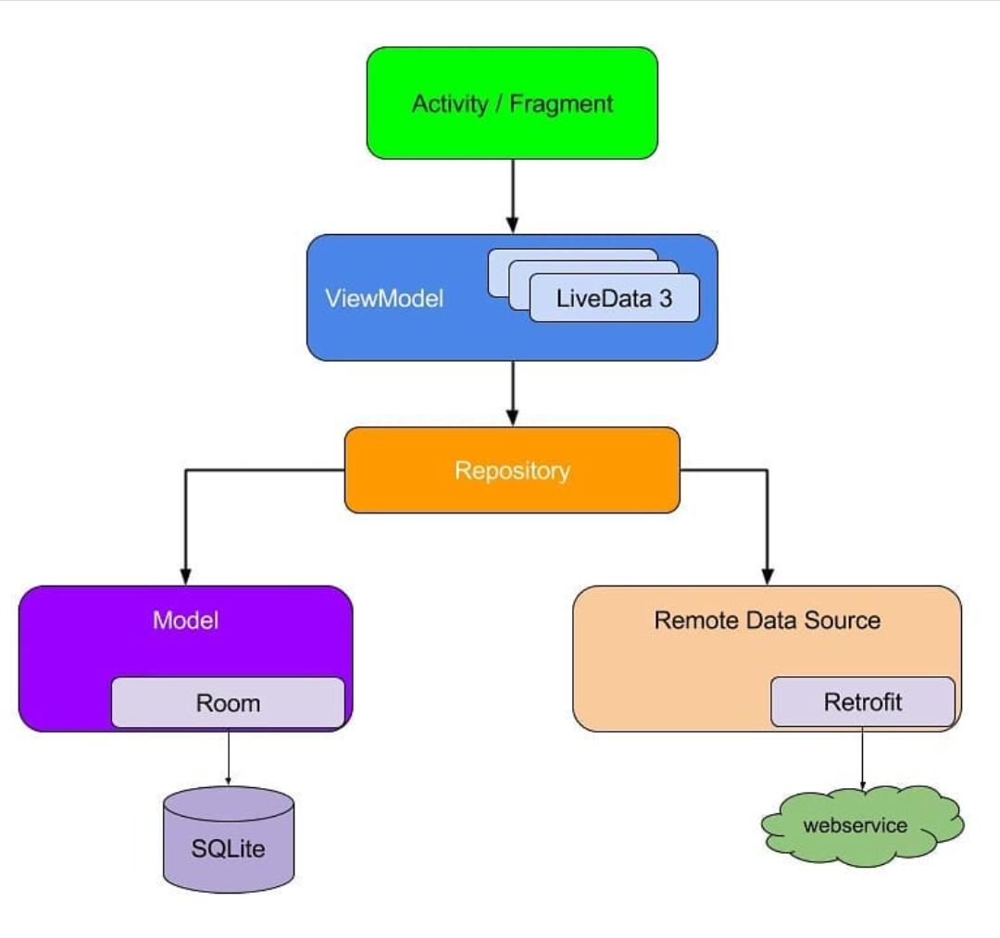

  
  
  # Cryptotracker
  

This is a sample Android application I developed in order to practice Android Architecture Components and MVVM architecture. Track all the Cryptocurrency coins that trends on crypto market.

## Libraries used in this project

- [Android architecture components](https://developer.android.com/topic/libraries/architecture/)
  - [ViewModel](https://developer.android.com/topic/libraries/architecture/viewmodel)
  - [LiveData](https://developer.android.com/topic/libraries/architecture/livedata)
- [Koin](https://insert-koin.io/)
- [JUnit](https://junit.org/junit5/) 
- [Mockito](https://site.mockito.org/)

# Project Architecture

  
  
  

